Petit guide d’installation d’Archlinux avec Gnome 3.26.x / Plasma 5.11.x / Xfce / Mate-Desktop
==============================================================================================

Dans ce petit guide, je vais détailler l’installation d’Archlinux avec Gnome 3.26 et suivant, Plasma 5.11.x, Xfce et Mate-Desktop. L’installation terminée proposera un environnement suffisamment étoffé pour être utilisable.

Pour des raisons pratiques, je n’aborde nullement l’ajout de matériel comme les imprimantes, les scanners, ou encore les webcams. Je vous renvoie aux wikis anglophone <https://wiki.archlinux.org/> et francophone <http://wiki.archlinux.fr/Accueil> pour ce genre de manipulations.

**NOTE 1 :** Ce tutoriel est **volontairement simplifié**. Il va vous permettre de voir comment installer une ArchLinux **en solo**. **Ensuite, s’il y a des spécificités liées à votre matériel, c’est au cas par cas qu’il faut regarder et compulser frénétiquement les wikis ci-dessus.** Si vous voulez installer une Archlinux **en parallèle **d’une installation de MS-Windows, c’est en dehors du cadre de ce document.

**NOTE 2 :** Pour Lxde et LXQt, il faudra voir avec le tutoriel de février 2016 : <http://frederic.bezies.free.fr/blog/?p=14045>

**NOTE 3 :** Pour Budgie Desktop et Cinnamon, je vous conseille de vous reporter au tutoriel d’avril 2017 : <http://frederic.bezies.free.fr/blog/?p=15985>

**NOTE 4 :** Les images ISO d’installation ne sont plus qu’en 64 bits à compter du 1er mars 2017. Si vous avez un vieux PC en 32 bits, il vous faudra la dernière image ISO disponible sur le site [Archlinux32](https://www.archlinux32.org/).

Pour cette version du guide, je me suis basé sur la dernière ISO officielle, celle qui utilise les scripts d’installation. En novembre 2017, c’est la 2017.11.01.

Merci à Ewolnux, Xarkam, Frédéric Sierra, Ludovic Riand, Vincent Manillier, Thomas Pawlowski, Quentin Bihet, Igor Milhit et André Ray pour leurs conseils et remarques. Ce document est proposé sous licence [CC-BY-SA 4.0.](http://creativecommons.org/licenses/by-sa/4.0)

I) Installons notre base
------------------------

Installer une Archlinux, c’est comme construire une maison. On commence par les fondations, et on rajoute les murs et le reste par la suite. L’image ISO utilisée est la archlinux-2017.11.01-x86\_64.iso, mise en ligne début novembre 2017.

La machine virtuelle est une machine VirtualBox à laquelle j’ai rajouté un disque virtuel de 128 Go. Des points spécifiques concernant l’utilisation dans VirtualBox sont indiqués. Par défaut, le noyau proposé par Archlinux est un noyau « court terme ». Si vous voulez un noyau LTS, je vous expliquerai comment faire.

Dans cette partie, certaines sections seront dédoublées à cause des différences entre l’installation en mode Bios et en mode UEFI.

Commençons par une installation en mode Bios, du point de vue du partitionnement et de l’attribution des partitions. Si vous utilisez une machine réelle ou virtuelle avec l’UEFI, des instructions spécifiques sont détaillées par la suite.

#### Partitionnement et attribution des partitions en mode Bios :

Voici donc l’écran qui nous permet de démarrer. Comme vous pouvez le voir, on peut démarrer soit avec un noyau 32 soit avec un noyau 64 bits. Il n’y a plus grande différence, sauf au niveau de certains logiciels typiquement 32 bits, mais j’expliquerai plus bas comment faire cohabiter 32 et 64 bits.


*Illustration 1: écran de démarrage en mode Bios, uniquement en 64 bits (depuis mars 2017)*


La première chose à faire, c’est d’avoir le clavier français :

```loadkeys fr```

Pour le partitionnement, si vous avez peur de faire des bêtises, il est plus prudent de passer par un LiveCD comme gParted disponible à l’adresse suivante : <http://gparted.org/>

Avec cfdisk, sur l’écran de démarrage suivant, on choisit l’option « dos » pour le « label type » à appliquer.

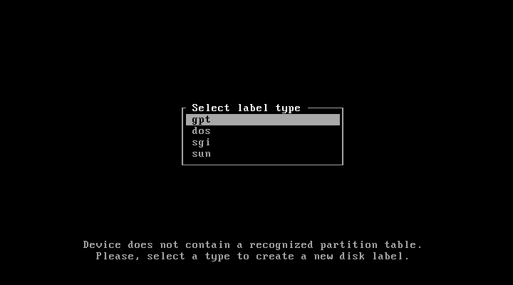

*Illustration 2: premier démarrage de cfdisk*

Pour le partitionnement en question :

  | Référence |  Point de montage |  Taille                           |   Système de fichiers |
  |-----------|-------------------|-----------------------------------|-----------------------|
  | /dev/sda1 | /boot             |  512 Mo                           |  ext2                 |
  | /dev/sda2 |                   | Taille de la mémoire vive ou plus |  swap                 |
  | /dev/sda3 |  /                | 20 Go                             |  ext4                 |
  | /dev/sda4 | /home             | Le reste du disque                | ext4                  |
  

Il ne faut pas oublier de définir la partition attribuée à /boot comme démarrable (bootable). Ce qui donne l’écran suivant dans cfdisk.


*Illustration 3: cfdisk en action*

Pour le formatage des partitions, il suffit d’entrer les commandes suivantes :

```
mkfs.ext2 /dev/sda1
mkfs.ext4 /dev/sda3
mkfs.ext4 /dev/sda4
```

Sans oublier la partition de swap :

```
mkswap /dev/sda2
swapon /dev/sda2
```

On va ensuite créer les points de montage et y associer les partitions qui correspondent.

```
mount /dev/sda3 /mnt
mkdir /mnt/{boot,home}
mount /dev/sda1 /mnt/boot
mount /dev/sda4 /mnt/home
```

On peut passer ensuite à l’installation de la base.

#### Partitionnement et attribution des partitions en mode UEFI :

Voici donc l’écran qui nous permet de démarrer en mode UEFI, supporté uniquement pour la version 64 bits.


*Illustration 4: démarrage en mode UEFI*

Comme pour la section concernant le partitionnement en mode Bios, si vous craignez de faire des bêtises, vous pouvez utiliser gParted en mode liveCD : <http://gparted.org/>

Il faut se souvenir qu’il faut **obligatoirement** une table de partition GPT en cas d’installation en mode UEFI. Si vous n’êtes pas passé par gParted, il faut utiliser l’outil cgdisk.

  |Référence  |  Point de montage |  Taille                           | Système de fichiers |
  |-----------|-------------------|-----------------------------------|---------------------|
  | /dev/sda1 | /                 | 20 Go                             |  ext4               |
  | /dev/sda2 | /boot             | 512 Mo                            |  fat32              |
  | /dev/sda3 |                   | Taille de la mémoire vive ou plus |  swap               |
  | /dev/sda4 | /home             | Le reste du disque                |  ext4               |
  
**Note :** pour la partition /boot, il faut qu’elle soit étiquetée en EF00 à sa création. Pour le swap, c’est la référence 8200.

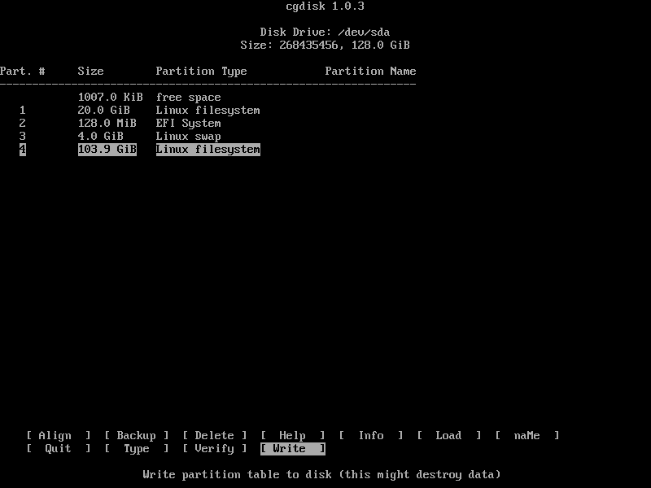
*Illustration 5: cgdisk en action pour un partitionnement avec un UEFI*

Le partitionnement à appliquer ? C’est le suivant :

```
mkfs.ext4 /dev/sda1
mkfs.fat -F32 /dev/sda2
mkfs.ext4 /dev/sda4
```

Sans oublier la partition de swap :

```
mkswap /dev/sda3
swapon /dev/sda3
```

Et pour les points de montage :

```
mount /dev/sda1 /mnt
mkdir /mnt/{boot,home}
mount /dev/sda2 /mnt/boot
mount /dev/sda4 /mnt/home
```

On peut passer à l’installation de la base.

#### Installation de la base de notre Archlinux :

Après avoir procédé au partitionnement et à l’attribution des partitions, on peut attaquer les choses sérieuses, à savoir récupérer la base de notre installation. mais avant toute chose, choisissons le miroir le plus rapide.

**Note :** si vous utilisez une connexion wifi, je vous conseille de voir cette page du wiki anglophone d'archlinux : <https://wiki.archlinux.org/index.php/Netctl>

**Note 2 :** si vous êtes derrière un serveur proxy, il faut rajouter les lignes suivantes avec les valeurs qui vont bien. Merci à Nicolas pour l'info :)

```
export http_proxy=http://leproxy:leport/
export https_proxy=$http_proxy
export ftp_proxy=$http_proxy
```

Avec l’outil nano nous allons modifier le fichier /etc/pacman.d/mirrorlist pour ne garder qu’un seul miroir. Le plus proche géographiquement et aussi le plus rapide possible. Pour une personne vivant en France, c’est **de préférence** mir.archlinux.fr et / ou archlinux.polymorf.fr.

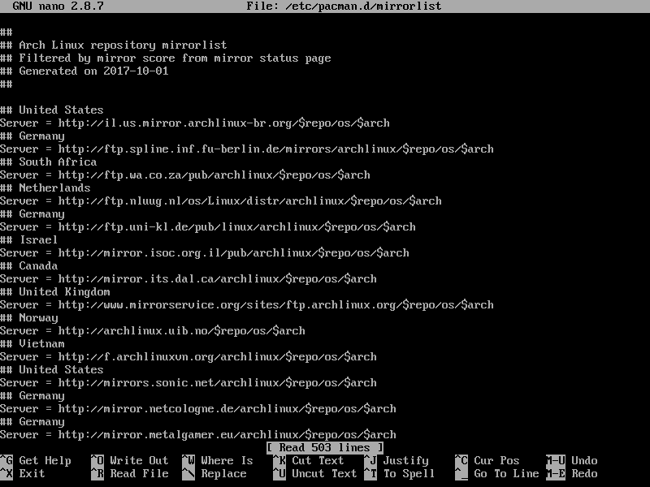

*Illustration 6: la liste des miroirs disponibles.*

J’ai utilisé le raccourci clavier suivant : **ALT+R**. On entre dans un premier temps « Server » (sans les guillemets). On presse la touche entrée. On saisit « \#Server » (sans les guillemets) pour commenter tous les serveurs.

Avec le raccourci clavier **CTRL+W**, il suffit de saisir le nom du serveur qu’on veut utiliser et enlever la « \# » sur sa ligne. Un **CTRL+X** suivi de la touche « y » (pour yes) permet d’enregistrer la modification.

On passe à l’installation de la base. La deuxième ligne rajoute certains outils bien pratique à avoir dès le départ. On peut ensuite s’attaquer à l’installation proprement dite.

```
pacstrap /mnt base base-devel
pacstrap /mnt zip unzip p7zip vim mc alsa-utils syslog-ng mtools dosfstools lsb-release ntfs-3g exfat-utils **(sur une seule ligne !)**
```

Si on veut utiliser un noyau linux long terme, il faut rajouter à la deuxième ligne pacstrap le paquet linux-lts. Pour ntfs-3g, c’est utile si vous êtes amené à utiliser des disques formatés en ntfs. Si ce n’est pas le cas, vous pouvez l’ignorer allègrement.

**Note :** exfat-utils m’a été conseillé par André Ray pour la prise en charge des cartes SD de grande capacité. Merci pour le retour !

Maintenant que les outils de base sont installés, il faut générer le fichier /etc/fstab qui liste les partitions présentes.

```
genfstab -U -p /mnt >> /mnt/etc/fstab
```

Au tour du chargeur de démarrage. J’utilise Grub2 qui s’occupe de tout et récupère les paquets qui vont bien. Le paquet os-prober est indispensable pour un double démarrage.

1\) Pour un ordinateur avec BIOS :

```
pacstrap /mnt grub os-prober
```

2\) Pour un ordinateur avec UEFI :

```
pacstrap /mnt grub os-prober efibootmgr
```

On passe aux réglages de l’OS qu’on vient d’installer. Il faut donc y entrer. On utilise la commande suivante :

```
arch-chroot /mnt
```

Avant d’aller plus loin, voici quelques infos pratiques. Cela concerne les pays francophones comme la Belgique, la Suisse, le Luxembourg ou encore le Canada francophone.

Nous allons par la suite créer des fichiers qui demanderont des valeurs précises. Les voici résumées ici :

  
  | Pays       | Locale (LANG) | Clavier (KEYMAP) |
  |------------|---------------|------------------|
  | Belgique   |  fr\_BE.UTF-8 |  be-latin1       |
  | Canada     |  fr\_CA.UTF-8 |  cf              |
  | France     |  fr\_FR.UTF-8 |  fr-latin9       |
  | Luxembourg |  fr\_LU.UTF-8 |  fr-latin9       |
  | Suisse     |  fr\_CH.UTF-8 |  fr\_CH          |
  
Pour avoir le bon clavier en mode texte, créez le fichier /etc/vconsole.conf. Il suffira de l’adapter si le besoin s’en fait sentir.

```
KEYMAP=fr-latin9
FONT=lat9w-16
```

Pour avoir la localisation française, le fichier /etc/locale.conf doit contenir la bonne valeur pour LANG. Pour un personne en France métropolitaine :

```
LANG=fr_FR.UTF-8
LC_COLLATE=C
```
**Note :** La deuxième ligne est nécessaire si on apprécie d’avoir le tri par la « casse » (majuscule puis minuscule) activé. Merci à Igor Milhit pour la remarque !

Il faut vérifier que la ligne fr\_FR.UTF-8 UTF-8 dans le fichier /etc/locale.gen n’a pas de \# devant elle. Ainsi que la ligne en\_US.UTF-8 UTF-8. Évidemment, la valeur fr\_FR.UTF-8 doit être modifiée si besoin est. On va maintenant générer les traductions :

```
locale-gen
```

On peut spécifier la locale pour la session courante, à modifier en fonction de votre pays :

```
export LANG=fr_FR.UTF-8
```

Le nom de la machine ? Il est contenu dans le fichier **/etc/hostname**. Il suffit de taper le nom sur la première ligne. Par exemple : *fredo-archlinux-gnome.* À remplacer par le nom de la machine bien entendu.

Le fuseau horaire ? Une seule étape. Prenons le cas d’une installation avec le fuseau horaire de Paris. Tout dépend de votre lieu de résidence. On commence par créer un lien symbolique :

```
ln -sf /usr/share/zoneinfo/Europe/Paris /etc/localtime
```

Ensuite, deux cas se présentent. Soit on a une machine en mono-démarrage sur Archlinux, et on peut demander à ce que l’heure appliquée soit UTC, soit un double démarrage avec MS-Windows. Restons dans ce premier cas.

```
hwclock --systohc --utc
```

**Sinon, on ne touche à rien.** MS-Windows est un goujat dans ce domaine.

Étape suivante ? Générer le fichier de configuration de Grub.

```
mkinitcpio -p linux ou **linux-lts** si vous voulez le noyau lts.
grub-mkconfig -o /boot/grub/grub.cfg
```

**Note** : si vous avez une « hurlante » contenant « /run/lvm/lvmetad.socket: connect failed » ou quelque chose d’approchant, ce n’est pas un bug. C’est une alerte sans conséquence. Cf <https://wiki.archlinux.org/index.php/GRUB#Boot_freezes>

1\) Pour une installation en mode BIOS :

```
grub-install --no-floppy --recheck /dev/sda
```

**2) Pour une installation en mode UEFI :**

Il faut déjà vérifier la présence de la variable efivars. Si en entrant la commande mount, vous avez dans la liste une réponse du style :

```
efivars on /sys/firmware/efi/efivars type efivars (rw,nosuid,nodev,noexec,relatime)
```

Dans ce cas, vous pouvez aller directement à la ligne du grub-install, ci-dessous, et sauter la première ligne de commande. La deuxième ligne est d’un seul tenant.

```
mount -t efivarfs efivarfs /sys/firmware/efi/efivarfs
grub-install --target=x86_64-efi --efi-directory=/boot --bootloader-id=arch_grub --recheck
```

De plus, pour éviter tout problème de démarrage par la suite, il est conseillé de rajouter les commandes suivantes :

```
mkdir /boot/EFI/boot
cp /boot/EFI/arch_grub/grubx64.efi /boot/EFI/boot/bootx64.efi
```

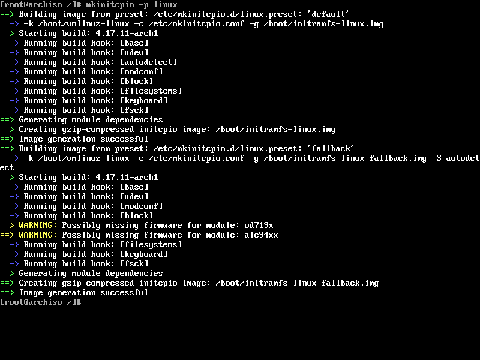

*Illustration 7 : Génération du noyau linux 4.13.9 début novembre 2017*

Bien entendu, aucune erreur ne doit apparaître. On donne un mot de passe au compte root :

```
passwd root
```

Pour le réseau, installer et activer NetworkManager est une bonne idée. Vous pouvez remplacer NetworkManager par le duo wicd et wicd-gtk **en cas de problème.** Pour wicd :

```
pacman -Syy wicd wicd-gtk
systemctl enable wicd
```

Et pour Networkmanager :

```
pacman -Syy networkmanager
systemctl enable NetworkManager
```

**NOTE 1 :** si vous n’utilisez pas NetworkManager, je vous renvoie à cette page du wiki anglophone d'Archlinux, qui vous aidera dans cette tâche : <https://wiki.archlinux.org/index.php/Netctl>

**NOTE 2 :** netctl et networkmanager rentrent en conflit et **ne doivent pas** être utilisé en même temps. D’ailleurs, netctl et wicd entre aussi en conflit. Une règle simple : un seul gestionnaire de connexion réseau à la fois !

**NOTE 3 :** si vous voulez utiliser des réseaux wifi directement avec NetworkManager et son applet, le paquet gnome-keyring est indispensable. Merci à Vincent Manillier pour l’info.

Dernier réglage, **optionnel** si on veut avoir accès à l’outil yaourt, il faut ajouter ceci au fichier /etc/pacman.conf à la fin. Une fois yaourt installé, on peut enlever **sans aucun risque** les lignes en question.

```
[archlinuxfr]
SigLevel = Never
Server = http://repo.archlinux.fr/$arch
```

Si vous voulez utiliser un outil comme Skype (qui est uniquement en 32 bits) et que vous installez un système 64 bits, il faut décommenter (enlever les \#) des lignes suivantes :

```
#[multilib]
#Include = /etc/pacman.d/mirrorlist
```
On peut maintenant quitter tout, démonter proprement les partitions et redémarrer.

C’est un peu plus délicat qu’auparavant. Au moins, on voit les étapes à suivre.

```
exit
umount -R /mnt
reboot
```

Voilà, on peut redémarrer. On va passer à la suite, largement moins ennuyeuse !

II) Installons maintenant l’environnement graphique !
-----------------------------------------------------

Nous attaquons donc la partie la plus intéressante, l’installation de l’environnement graphique. Il y a des étapes communes à tous les environnements. Un peu plus loin est indiquée la partie concernant **uniquement** Gnome.

Une fois le système démarré, on se connecte **en root**. Étant donné que j’ai installé NetworkManager (ou wicd selon les goûts) à l’étape précédente, le réseau fonctionne directement. On tape les lignes de commande suivantes pour mettre à jour les dépôts et installer yaourt un outil qui va nous simplifier grandement la vie.

Ainsi que ntp (synchronisation de l’heure en réseau) et cronie (pour les tâches d’administration à automatiser). L’installation de yaourt dépend de l’ajout du dépôt archlinuxfr, bien entendu.

Une fois yaourt installé (si on le désire), on peut enlever le dépôt archlinuxfr du fichier /etc/pacman.conf car yaourt est disponible sur AUR.

```
pacman -Syy
pacman -S yaourt ntp cronie
```
**Note :** si on veut avoir les logs en clair en cas de problème, il faut modifier avec nano (ou vim) le fichier /etc/systemd/journald.conf en remplaçant la ligne :

```
#ForwardToSyslog=no
```

par :

```
ForwardToSyslog=yes
```

Les outils en place, on lance alsamixer avec la commande du même nom, pour configurer le niveau sonore :

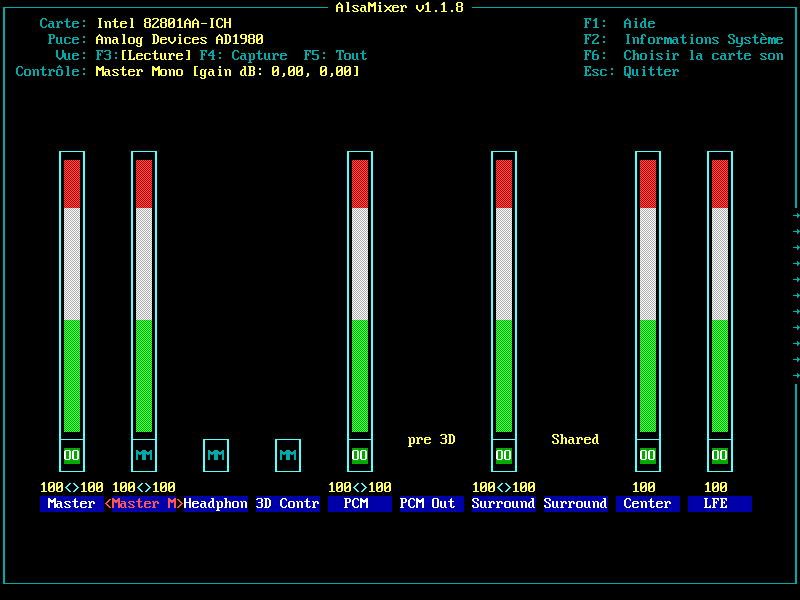

*Illustration 8: alsamixer en action*

Une fois l’ensemble configuré, pour le conserver tel quel, il suffit d’entrer :

```
alsactl store
```

Nous sommes dans le multimédia ? Restons-y.

On va installer l’ensemble des greffons gstreamer qui nous donneront accès aux fichiers multimédias une fois Gnome lancé. Si vous n’avez pas installé yaourt, il faudra le remplacer par **pacman -S** ou **sudo pacman -S** quand vous utiliserez votre compte utilisateur « normal » plus tard.

Pour l’exécution de la ligne suivante, il est demandé de choisir un support pour OpenGL. Pour le moment, on choisit MesaGL. La modification correspondant à votre matériel sera faite lors de l’installation de Xorg. Ainsi que la version « libx264 » proposé en premier choix. Merci à Adrien de Linuxtricks pour m’avoir aidé à réduire la longueur de la ligne de commande :)

```
pacman -S gst-plugins-{base,good,bad,ugly} gst-libav
```

gst-libav ? Il prend en charge tout ce qui est x264 et apparenté.

Passons à l’installation de Xorg. Le paquet xf86-input-evdev est obsolète depuis début janvier 2017, à cause du passage à xorg-server 1.19.

**Note :** il n’y a pas d’espace entre le – et le { vers la fin de la commande suivante.

```
pacman -S xorg-{server,xinit,apps} xf86-input-{mouse,keyboard} xdg-user-dirs
```

Si on utilise un ordinateur portable avec un pavé tactile, il faut rajouter le paquet xf86-input-synaptics ou **de préférence** xf86-input-libinput.

Il faut ensuite choisir le pilote pour le circuit vidéo. Voici les principaux pilotes, sachant que le paquet xf86-video-vesa englobe une énorme partie des circuits graphiques, dont ceux non listés dans le tableau un peu plus loin. En cas de doute : <https://wiki.archlinux.org/index.php/Xorg#Driver_installation>

Pour Nvidia, c’est un casse-tête au niveau des pilotes propriétaires. Le plus simple est de se référer au wiki d'Archlinux : <https://wiki.archlinux.org/index.php/NVIDIA>

 
 | Circuits graphiques | Pilotes libres     | Pilotes non libres (si existant)                     |
 |---------------------|--------------------|------------------------------------------------------|
 | AMD                 | xf86-video-ati     |  Catalyst (disponible sur AUR, le dépôt utilisateur) |
 | Intel               | xf86-video-intel   |                                                      |
 | Nvidia              | xf86-video-nouveau | Nvidia (cf le wiki d'archlinux) pour la version à installer en fonction de la carte graphique          |

Dans le cas d’une machine virtuelle, j’ai utilisé le paquet **xf86-video-vesa**. On passe ensuite à l’installation des polices. Voici la ligne de commande pour les principales.

```
pacman -S ttf-{bitstream-vera,liberation,freefont,dejavu}
```

**Note 2 :** pour les polices Microsoft, le paquet ttf-ms-fonts, elles sont sur le dépôt AUR, donc il faut utiliser yaourt pour les récupérer et les installer.

Cependant, depuis l’arrivée de Pacman 4.2, il est impossible de construire un paquet avec l’option --asroot. Donc vous devrez lancer la commande ci-dessous en tant qu’utilisateur simple.

```
yaourt -S ttf-ms-fonts
```

Si vous faites une installation dans VirtualBox, il faut deux paquets. En plus de xf86-video-vesa, il faut le paquet virtualbox-guest-utils. Cependant, il y a deux choix qui arrive pour ce paquet.

Ce qui donne :

```
pacman -S xf86-video-vesa
pacman -S virtualbox-guest-utils
```


*Illustration 9: Choix du paquet à installer concernant virtualbox-guest-utils*

Le premier nécessite le paquet linux-headers (ou linux-lts-headers), le deuxième propose les modules noyaux déjà précompilés. **On choisit donc la deuxième option.**

**Note 3 :** si vous avez décidé d’installer le noyau lts, il faut installer les paquets linux-lts-headers et virtualbox-guest-dkms. Il n’y a plus de modules précompilés pour le noyau linux-lts

La prise en charge des modules noyau se fait avec la commande systemctl suivante :

```
systemctl enable vboxservice
```

**Note :** si vous installez un jour VirtualBox sur une machine réelle je vous renvoie à cette page du wiki francophone : <https://wiki.archlinux.fr/VirtualBox>

On va rajouter quelques outils, histoire de ne pas voir un environnement vide au premier démarrage.

On commence par tout ce qui est graphique : gimp, cups (gestion de l’imprimante) et hplip (si vous avez une imprimante scanner Hewlett Packard). Le paquet python-pyqt5 est indispensable pour l’interface graphique de HPLIP :

```
pacman -S cups gimp gimp-help-fr hplip python-pyqt5
```

La série des paquets foomatic permet d’avoir le maximum de pilotes pour l’imprimante. Pour être tranquille avec son imprimante :

```
pacman -S foomatic-{db,db-ppds,db-gutenprint-ppds,db-nonfree,db-nonfree-ppds} gutenprint
```

Il y a deux versions supportés par Archlinux pour LibreOffice, en conformité avec ce que propose la Document Foundation. Pour la version **stable** et les utilisateurs **prudents**, on utilise la ligne de commande :

```
pacman -S libreoffice-still-fr
```

Pour les utilisateurs plus **aventureux**, qui veulent la version récente :

```
pacman -S libreoffice-fresh-fr
```
On rajoute ensuite Mozilla Firefox en français :

```
pacman -S firefox-i18n-fr
```

Vous préférez Chromium ?

```
pacman -S chromium
```

On crée un utilisateur avec la commande suivante, qui sera indispensable pour appliquer un des addenda si vous ne voulez pas utiliser Gnome.

```
useradd -m -g wheel -c 'Nom complet de l’utilisateur' -s /bin/bash nom-de-l’utilisateur **sur une seule ligne !**
passwd nom-de-l’utilisateur
```

Avant de finir, on va configurer sudo en utilisant visudo. En effet, il nous suffit de modifier une ligne pour que l’on puisse accéder en tant qu’utilisateur classique aux droits complets sur la machine de manière temporaire.

Il faut aller, en utilisant la flèche du bas jusqu’à la ligne :

```
#Uncomment to allow members of group wheel to execute any command
```
Et enlever le \# sur la ligne qui suit. La séquence de touches « Échap : w et q » permet de converser la modification.

**À partir d’ici, c’est la section dédiée à Gnome qui commence :**

On passe enfin au morceau de choix : l’installation de Gnome, les extensions étant indispensables pour avoir le mode « Gnome Classique ». Le paquet telepathy permet d’ajouter le maximum de support pour les comptes utilisateurs en ligne.

```
pacman -S gnome gnome-extra system-config-printer telepathy shotwell rhythmbox
```

Si vous voulez utiliser l’outil Gnome Logiciels, même si ce n’est pas des plus fonctionnels sous Archlinux :

```
pacman -S gnome-software
```

L’installation de Gnome est maintenant terminée.

**Fin de la section uniquement consacrée à Gnome, ici, il y a des points communs à tous les environnements proposés.**

Pour être certain d’avoir le bon clavier au démarrage de GDM ou d’un autre gestionnaire de connexion comme sddm, lightdm ou lxdm, voici une petite commande à lancer (en modifiant le clavier selon les besoins) :

```
sudo localectl set-x11-keymap fr
```

Les valeurs étant à adapter en fonction de la locale et du clavier, bien entendu.

**Note 4 :** Si vous avez besoin de gérer des périphériques utilisant MTP (tablettes sous android par exemple), il vous faut rajouter les deux paquets gvfs-mtp et mtpfs.

Étant donné que systemd est utilisé, voici la liste des services à activer (avec une explication rapide), **qui sera la même pour chacun des environnements** proposés dans les « addenda » :

```
systemctl enable syslog-ng@default → *gestion des fichiers d’enregistrement d’activité*
systemctl enable cronie → *pour les tâches récurrentes*
systemctl enable avahi-daemon → *dépendance de Cups*
systemctl enable avahi-dnsconfd → *autre dépendance de Cups*
systemctl enable org.cups.cupsd → *cups pour les imprimantes*
systemctl enable bluetooth → *uniquement si on a du matériel bluetooth*
systemctl enable ntpd → *pour synchroniser l’heure en réseau.*
```

**Note 5** : dans un premier temps, il ne faut pas activer le gestionnaire de connexion de l’environnement choisi. On fait uniquement un systemctl start suivi du nom du gestionnaire en question.

Comme je présente Gnome dans la section principale, c’est GDM. Sinon, il faut se référer à l’addenda correspondant.

Sinon, il suffit de se référer à l’addenda correspondant à l’environnement de votre choix.

Au démarrage suivant, GDM nous accueille, et nous pouvons nous connecter.

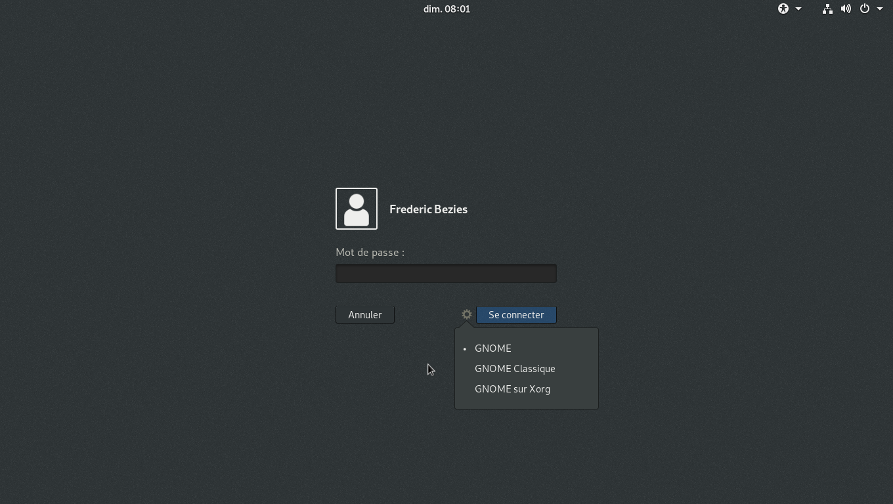

*Illustration 10: GDM 3.26.2.1 avec les sessions Wayland et Gnome sur Xorg*

III) Finalisons l’installation de Gnome.
----------------------------------------

**Note :** à partir de maintenant, nous sommes connectés en tant qu’utilisateur classique.

Quelques outils à rajouter : xsane (pour le scanner), mais aussi unoconv (pour l’aperçu des fichiers dans Gnome Documents). On pourrait rajouter Adobe Flash, mais pourquoi rajouter cette usine à faille de sécurité ?

```
yaourt -S xsane unoconv
```

Il faut penser à vérifier que le clavier est correctement configuré. Ce qui se fait dans menu système unifié, options de configuration.

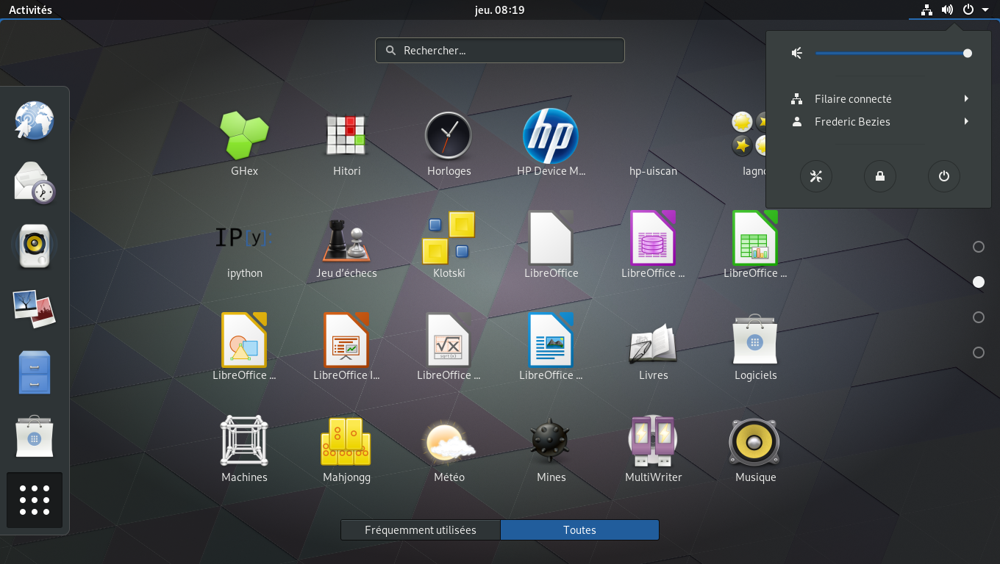

*Illustration 11: Gnome 3.26.2 en vue activités*

On va personnaliser le bureau Gnome en lui ajoutant la date complète et les boutons pour minimiser et maximiser les fenêtres avec Gnome Tweak Tool.

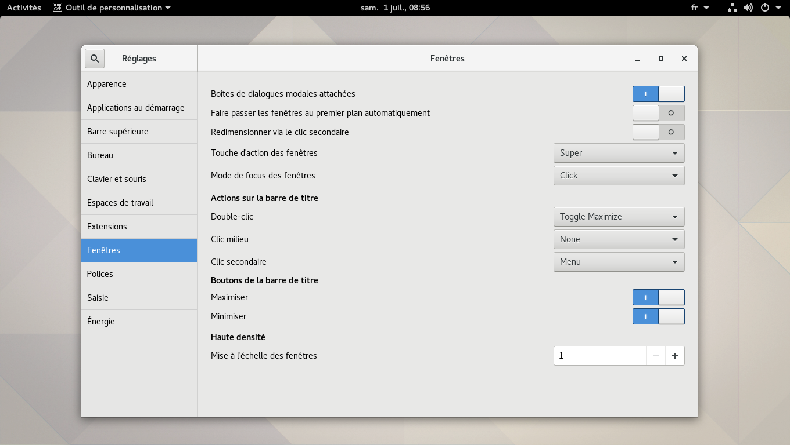

*Illustration 12: Gnome Tweak Tool en action.*

Pour finir des captures d’écran du mode « Gnome Shell » et « Gnome Classique ».

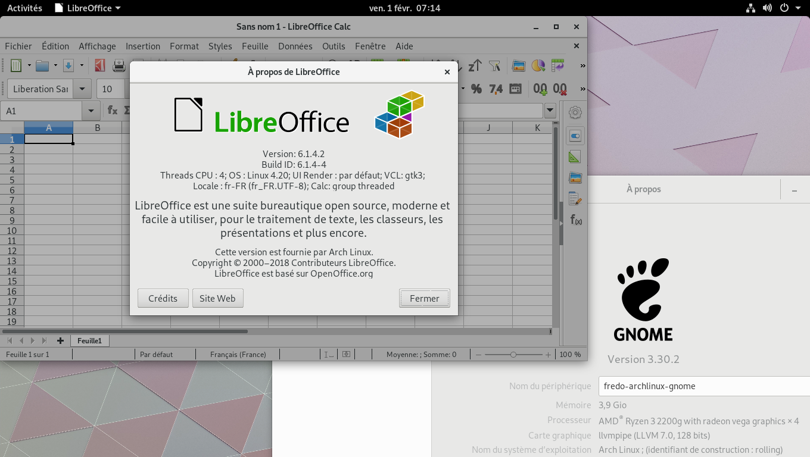

*Illustration 13: Gnome Shell 3.26.2 et « LibreOffice-fresh »*

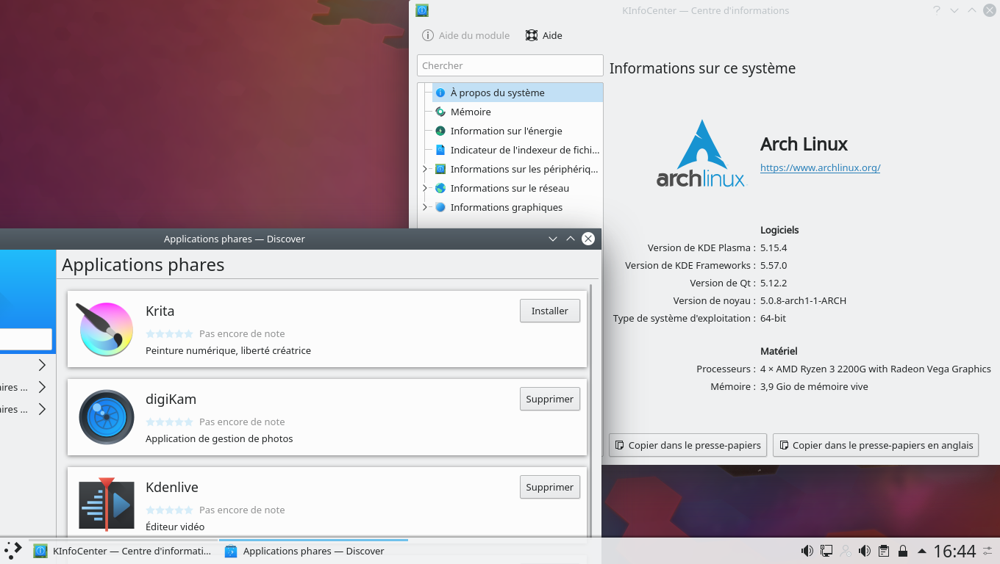

*Illustration 14: Gnome classique 3.26.2 en action*

Voila, le guide est maintenant fini. Cependant, je n’ai pas abordé l’installation d’un pare-feu. C’est quelque chose de plus technique.

J’ai surtout voulu faire un **guide rapide**, histoire de montrer qu’en une petite heure on pouvait avoir un environnement installé et assez complet pour le fignoler par la suite.

Bonne découverte !

IV) Addendum 1 : installer Plasma 5.11.x
----------------------------------------

**Note :** commandes à entrer en tant qu’utilisateur classique. Si vous n’avez pas yaourt, sudo pacman -S sera à utiliser. Kde-l10n-fr étant à remplacer par votre locale. Dans les précédentes versions, il y avait k3b, mais il a été intégré dans les kde-applications à partir de la version 17.04.

L’installation se déroule ainsi :

```
yaourt -S plasma kde-applications kde-l10n-fr amarok digikam breeze-kde4
```

Le paquet breeze-kde4 permet de donner un thème « KDE 5 » aux applications non encore adaptées pour le nouvel environnement.

Pour avoir le bon agencement clavier dès la saisie du premier caractère du mot de passe, il faut entrer la commande suivant avant de lancer pour la première fois sddm :

```
sudo localectl set-x11-keymap fr
```

Bien entendu, la valeur à utiliser après set-x11-keymap doit être identique à celle saisie plus haut quand on a configuré la base d'Archlinux. Sans oublier le correctif indiqué plus haut dans la section Gnome concernant le clavier français sous Xorg.

```
sudo systemctl start sddm
```

Si tout se passe bien, on peut utiliser :

```
sudo systemctl enable sddm
```

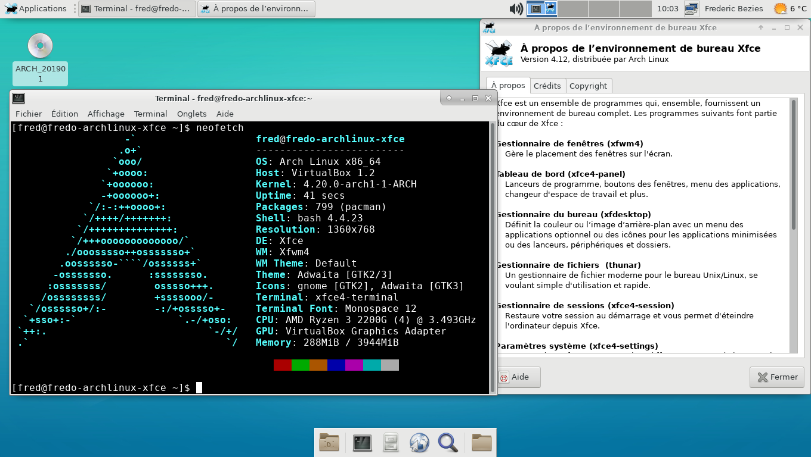

*Illustration 15: Plasma 5.11.x (vue de dossiers) avec les KDE Frameworks 5.38.0* 

V) Addendum 2 : installer Xfce
------------------------------

**Note :** commandes à entrer en tant qu’utilisateur classique. Si vous n’avez pas yaourt, sudo pacman -S sera à utiliser.

**Note 2 :** si vous avez besoin de gérer des périphériques utilisant MTP (tablettes sous android par exemple), il vous faut rajouter les deux paquets gvfs-mtp et mtpfs.

**Note 3 :** courant janvier 2017, gstreamer-0.10 a été déprécié, après 4 ans sans la moindre mise à jour par les développeurs, et par conséquent, le greffon audio de Xfce est désormais celui de Pulseaudio, d’où le rajout de pavucontrol dans la liste des paquets.

**Note 4 :** VLC a été remplacé par SMPlayer pour des raisons pratiques. VLC reviendra quand il sortira en version 3.0 officielle et finale.

Pour installer Xfce, il faut entrer :

```
yaourt -S xfce4 xfce4-goodies gvfs smplayer quodlibet python2-pyinotify lightdm-gtk-greeter midori xarchiver claws-mail galculator evince ffmpegthumbnailer xscreensaver pavucontrol pulseaudio pulseaudio-alsa libcanberra-{pulse,gstreamer} system-config-printer **→ (pour installer le support des imprimantes)**
```

SMPlayer et Quodlibet ? Pour la vidéo et l’audio. Midori ? Pour la navigation internet. Pour les périphériques amovibles, gvfs est obligatoire. Claws-mail ou Mozilla Thunderbird (avec le paquet thunderbird-i18n-fr) pour le courrier. Lightdm étant pris, car plus rapide à installer. Le paquet python2-pyinotify est nécessaire pour activer le greffon de mise à jour automatique de la musicothèque sous Quodlibet.

Evince ? Pour les fichiers en pdf. On peut aussi remplacer xarchiver par fileroller. Quant à ffmpegthumbnailer, c’est utile si vous désirez avoir un aperçu des vidéos stockées sur votre ordinateur. Enfin, xscreensaver sert au verrouillage de l’écran.

Si vous utilisez NetworkManager, vous pouvez rajouter l’applet pour gérer et surveiller votre réseau avec le paquet « network-manager-applet ». Si vous voulez personnaliser votre lightdm :

```
yaourt -S lightdm-gtk-greeter-settings
```

Pour avoir le bon agencement clavier dès la saisie du premier caractère du mot de passe, il faut entrer la commande suivant avant de lancer pour la première fois lightdm :

```
sudo localectl set-x11-keymap fr
```

Pour lancer Xfce, il faut entrer dans un premier temps :

```
sudo systemctl start lightdm
```

Et si tout se passe bien, on peut utiliser :

```
sudo systemctl enable lightdm
```

**Note 5 :** pour avoir des plus jolies icônes, on peut installer le paquet AUR elementary-xfce-icons ou encore les mint-x-icons. mais après, c’est à vous de voir !

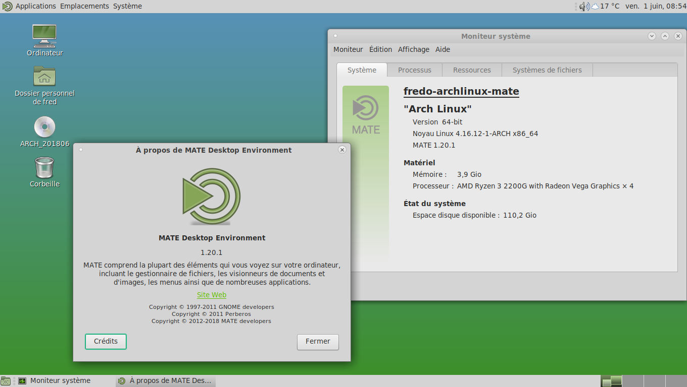

*Illustration 16: Xfce 4.12.0 en action.*

VI) Addendum 3 : installer Mate-Desktop
---------------------------------------

**Note :** commandes à entrer en tant qu’utilisateur classique. Si vous n’avez pas yaourt, sudo pacman -S sera à utiliser.

**Note 2 :** Mate 1.18 étant uniquement en gtk3, cela simplifie l’installation.

**Note 3 :**  Si vous avez besoin de gérer des périphériques utilisant MTP (tablettes sous android par exemple), il vous faut rajouter les deux paquets gvfs-mtp et mtpfs.

L’installation ressemble à celle de Xfce, donc pour les explications des paquets, cf l’addenda consacré à Xfce. Idem pour l’utilisation de NetworkManager si vous le voulez. Il ne faut pas oublier de rajouter un outil de gravure, comme Brasero si nécessaire. Pour le navigateur, Mozilla Firefox, Chromium ou encore Midori. C’est selon les goûts !

```
yaourt -S mate mate-extra lightdm-gtk-greeter gnome-icon-theme smplayer quodlibet python2-pyinotify accountsservice claws-mail  ffmpegthumbnailer pulseaudio pulseaudio-alsa libcanberra-{pulse,gstreamer} system-config-printer **→ (pour installer le support des imprimantes)**
```

Si vous voulez personnaliser votre lightdm :

```
yaourt -S lightdm-gtk-greeter-settings
```

Pour avoir le bon agencement clavier dès la saisie du premier caractère du mot de passe, il faut entrer la commande suivant avant de lancer pour la première fois lightdm :

```
sudo localectl set-x11-keymap fr
```

Pour lancer Mate Desktop, il faut entrer dans un premier temps :

```
sudo systemctl start accounts-daemon
sudo systemctl start lightdm
```
Si tout se passe bien, on peut utiliser :

```
sudo systemctl enable accounts-daemon
sudo systemctl enable lightdm
```
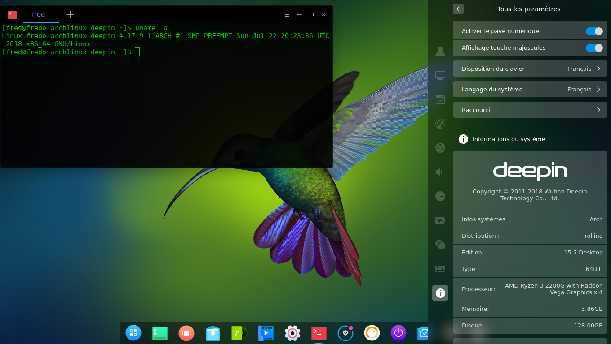

*Illustration 17: Mate Desktop 1.18.0*
  
