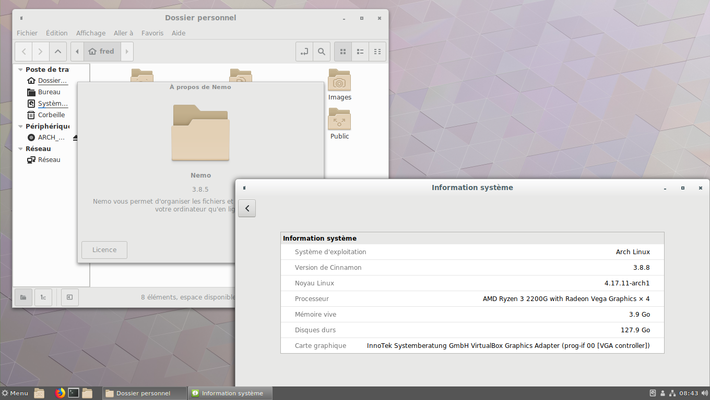

Installer Cinnamon
==================

.. note::
    commandes à entrer en tant qu’utilisateur classique. Vous pouvez utiliser un enrobeur de pacman comme yaourt, trizen ou yay par exemple.

.. note::
    Si vous avez besoin de gérer des périphériques utilisant MTP (tablettes sous android par exemple), il vous faut rajouter les deux paquets gvfs-mtp et mtpfs. Si vous voulez la totalité des greffons gvfs (merci à SuperMarioS pour la ligne de commande) ::

    $ sudo pacman -S gvfs-{afc,goa,google,gphoto2,mtp,nfs,smb}

Comme pour Deepin, l’installation est assez courte.

::

  $ sudo pacman -S cinnamon cinnamon-translations gnome-terminal gnome-extra lightdm-gtk-greeter shotwell rhythmbox system-config-printer → (pour installer le support des imprimantes)

Si vous voulez personnaliser votre lightdm ::

  $ sudo pacman -S lightdm-gtk-greeter-settings

Pour avoir le bon agencement clavier dès la saisie du premier caractère du mot de passe, il faut entrer la commande suivante avant de lancer pour la première fois lightdm ::

  $ sudo localectl set-x11-keymap fr

Pour lancer Cinnamon, il faut entrer dans un premier temps ::

  $ sudo systemctl start lightdm

Si tout se passe bien, on peut utiliser ::

  $ sudo systemctl enable lightdm

*Illustration 18: Cinnamon 3.8.8*
